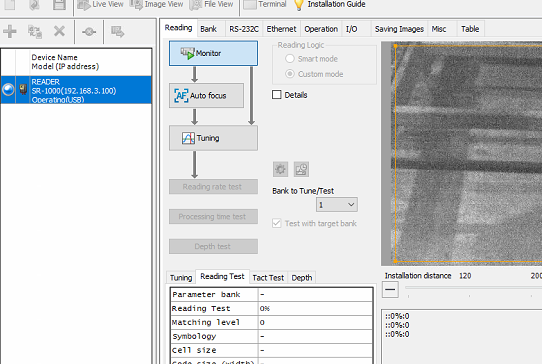
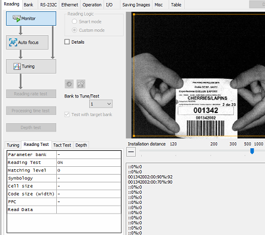
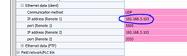

# Para la parte de la lectura de códigos de barra

Se intentó conectar por serial pero falló luego por usb y funcionó:

..........................................
Basándome en la imagen anterior que me mostraste (donde seleccionabas el tipo de interfaz), y viendo la actual, parece que primero debes elegir el tipo de conexión.
En la imagen actual, estás en la pestaña de configuración para "RS-232C".
Para usar USB, probablemente necesites:
Volver al paso donde se te presentan las opciones de "Ethernet", "USB", y "RS-232C" (como en la primera imagen que enviaste). Esto podría implicar cerrar esta ventana de configuración o buscar un botón de "Cambiar conexión" o similar.
Seleccionar la opción "USB" en esa pantalla.
Una vez seleccionado USB, es posible que aparezca una nueva pestaña de configuración específica para USB (similar a como ahora ves "RS-232C" y "Ethernet"), o que la conexión se establezca directamente si no requiere configuración adicional.
En la imagen actual no hay una pestaña visible para "USB", lo que sugiere que la selección del tipo de interfaz (USB, Ethernet, RS-232C) se hace en un paso previo.

En la pantalla actual, para ver los códigos de barra que se detectan, probablemente necesites:
Presionar el botón "Monitor": Este botón se encuentra en la parte superior del flujo de trabajo (Monitor -> Auto focus -> Tuning...). Al presionarlo, es muy probable que el rectángulo negro grande a la derecha muestre la imagen en vivo de lo que el lector está viendo.
Observar la imagen en vivo: Una vez que el monitor esté activo y apuntes el lector a un código de barras, deberías ver el código en esa área. A menudo, el software resalta el código detectado o muestra la información decodificada directamente sobre la imagen o en un panel cercano que podría aparecer.
Revisar las pruebas: Si ejecutas alguna de las pruebas como "Reading rate test", los resultados, incluyendo los códigos leídos, podrían mostrarse en la gráfica inferior ("Matching level") o en una sección de resultados que aparezca específicamente para la prueba.
Pestaña "Table": Aunque menos directo para una visualización en tiempo real, la pestaña "Table" (arriba a la derecha, junto a "Misc") podría ser un lugar donde se registren los códigos leídos después de una sesión de lectura o prueba.
Iconos de visualización en la barra de herramientas superior: Arriba a la izquierda, hay iconos como "Live View" (el que parece una cámara de video, el segundo desde la izquierda en la segunda fila de iconos). Hacer clic en él también podría activar la visualización en tiempo real en el área negra.
Principalmente, busca activar la función de "Monitor" o "Live View" para ver lo que el escáner está capturando en tiempo real. El área negra grande es donde se mostrará la imagen.

¡Excelente! Si ya confirmaste que la señal está entrando por USB (lo que se ve en la parte izquierda donde dice "READER SR-1000(...) Connected[USB]"), ahora necesitas saber cómo ese lector envía los datos a tu computadora.
Hay varias formas comunes en las que un lector de códigos de barras USB puede enviar datos:
Emulación de Teclado (Keyboard Wedge o HID Keyboard):
Cómo funciona: El lector se comporta como si fuera un teclado. Cuando escanea un código, "escribe" los caracteres del código seguidos, a menudo, de una tecla "Enter" (configurable).
Cómo obtener los datos: Simplemente abre cualquier aplicación que acepte entrada de texto (un bloc de notas, un campo de texto en una página web, Excel, tu propio software, etc.). Asegúrate de que el cursor esté activo en ese campo de texto y escanea un código. Los datos deberían aparecer como si los hubieras tecleado.
Verificación en el software actual: En la interfaz que me muestras, no hay una indicación directa de esto, pero es el modo más común por defecto para muchos lectores USB.
Puerto COM Virtual (VCP - Virtual COM Port):
Cómo funciona: El lector instala un driver que crea un puerto serie (COM) virtual en tu sistema. Tu aplicación necesitaría abrir este puerto COM y leer los datos como si fuera una conexión serie RS-232.
Cómo obtener los datos:
Necesitarías identificar qué puerto COM ha sido asignado. Puedes verlo en el "Administrador de dispositivos" de Windows (en "Puertos (COM y LPT)").
Luego, tu aplicación (o un software de terminal serie como PuTTY, TeraTerm, o el propio "Terminal" que se ve en la barra de herramientas de tu software) necesitaría conectarse a ese puerto COM con los parámetros correctos (baud rate, data bits, parity, stop bits).
Relevancia en tu software: Aunque estés conectado por USB, la pestaña "RS-232C" en tu software podría ser relevante si el modo USB es VCP, ya que los parámetros de comunicación serie (baud rate, etc.) definidos allí podrían aplicar a la comunicación del puerto COM virtual. Sin embargo, si el lector está en modo "Keyboard Wedge", esta pestaña no se usaría para la transferencia de datos por USB.
Verificación: Revisa el Administrador de Dispositivos. Si ves un nuevo puerto COM cuando conectas el lector, es probable que esté en este modo.
SDK o API del Fabricante:
Cómo funciona: El fabricante (en este caso, parece ser Keyence por el modelo SR-1000) podría ofrecer un Kit de Desarrollo de Software (SDK) o una API que permita a tu aplicación comunicarse directamente con el lector a través de USB para recibir datos y controlar el dispositivo.
Cómo obtener los datos: Necesitarías descargar el SDK, incluir las librerías en tu proyecto de desarrollo y usar las funciones proporcionadas por la API para leer los datos.
Verificación: Consulta la documentación del lector SR-1000 o el sitio web del fabricante.
Dentro del Software de Configuración (el que estás usando):
Pestaña "Table" o "Log": A menudo, este tipo de software de configuración tiene una sección donde se muestran los datos leídos, a veces en una tabla o un log. Busca una pestaña llamada "Table", "Data", "Log" o similar. En tu captura, veo una pestaña "Table" en la parte superior derecha. Es muy probable que los códigos leídos aparezcan allí.
Monitor/Live View: Como mencionamos antes, el área negra donde se muestra la imagen del "Monitor" o "Live View" podría superponer el texto del código leído.
Copiar/Pegar o Exportar: Si los datos aparecen en el software, podría haber una opción para copiarlos o exportarlos.
Pasos recomendados para averiguar cómo obtener los datos:
Prueba la Emulación de Teclado:
Abre el Bloc de Notas o cualquier editor de texto.
Asegúrate de que el cursor esté parpadeando en el editor.
Escanea un código de barras.
Si el código aparece en el editor, está en modo de emulación de teclado. Esta es la forma más sencilla de integrar la lectura en muchas aplicaciones.
Revisa la Pestaña "Table" en tu software:
Haz clic en la pestaña "Table" en la parte superior derecha de la aplicación.
Escanea algunos códigos y mira si aparecen allí.
Revisa el Administrador de Dispositivos:
Con el lector conectado, abre el Administrador de Dispositivos en Windows.
Busca en "Puertos (COM y LPT)" o "Dispositivos de interfaz de usuario (HID)" o incluso alguna categoría específica del fabricante. Si aparece un nuevo puerto COM, es probable que esté en modo VCP.
Consulta el Manual del Lector:
El manual del SR-1000 te dirá los modos de comunicación USB disponibles y cómo configurarlos (a veces escaneando códigos de barras de configuración especiales).
Lo más probable es que por defecto esté en modo emulación de teclado o que los datos se muestren en la pestaña "Table" de tu software. ¡Prueba eso primero!

El lector USB funciona en modo HID (Human Interface Device) / Emulación de Teclado:
En este modo, el lector se comporta directamente como un teclado para el sistema operativo.
Cuando escaneas un código, los datos se envían al campo de texto activo en tu computadora como si los hubieras tecleado.
En este caso, la aplicación "Autoid Keyboard Wedge" que me mostraste (la de la última captura) NO sería necesaria para la función básica de entrada de datos, porque el lector ya está haciendo ese trabajo por sí mismo.
Podrías llegar a usar esa aplicación si quisieras funciones muy avanzadas de manipulación de datos (prefijos, sufijos complejos, edición de datos) que el lector no pueda hacer por sí mismo, pero tendrías que ver cómo el lector (en modo HID) podría interactuar con un software que espera entrada serial o Ethernet (probablemente no directamente).
El lector USB funciona en modo Puerto COM Virtual (VCP - Virtual COM Port):
En este modo, el lector, aunque conectado por USB, crea un puerto serie virtual en tu computadora (ej. COM3, COM4, etc.).
El lector envía los datos a través de este puerto COM virtual, como si fuera una conexión RS-232.
En este caso, la aplicación "Autoid Keyboard Wedge" que me mostraste SÍ es útil y necesaria si quieres que esos datos recibidos por el puerto COM se conviertan en pulsaciones de teclado.
Configurarías la sección "Serial communication" de esa aplicación para que lea desde el puerto COM virtual asignado a tu lector. Luego, la aplicación tomaría esos datos y los "escribiría" en el campo de texto activo.
En resumen:
Si tu lector USB (como el SR-1000) ya está configurado para emular un teclado directamente (pruebas con el Bloc de Notas y los datos aparecen solos): Entonces la aplicación "Autoid Keyboard Wedge" no es necesaria para la función básica de "wedge". El lector ya lo hace.
Si tu lector USB se instala como un puerto COM virtual y no escribe directamente en el Bloc de Notas: Entonces SÍ necesitas una aplicación como "Autoid Keyboard Wedge" para tomar los datos de ese puerto COM y convertirlos en pulsaciones de teclado.
La aplicación que me mostraste está diseñada para tomar datos de una fuente (Ethernet o un Puerto Serial) y convertirlos en entrada de teclado. Si tu fuente USB ya es una entrada de teclado directa, esta aplicación no añade esa funcionalidad básica. Si tu fuente USB es un flujo de datos seriales (vía VCP), entonces sí la necesitas.

-------------------------------------------------
"Reading Test" es precisamente donde deberías poder ver los resultados de una prueba de lectura, incluyendo el dato del código de barras leído.
Fíjate en las filas:
Parameter bank: El banco de parámetros que se está utilizando para la prueba.
Reading Test: Aquí se mostrará el porcentaje de éxito de las lecturas durante la prueba (actualmente 0%).
Matching level: Nivel de coincidencia o calidad de la lectura (actualmente 0).
Symbology: Aquí debería aparecer el tipo de código de barras leído (ej: Code 128, QR Code, DataMatrix) después de una lectura exitosa.
cell size: El tamaño de la celda más pequeña del código.
Code size (width): El ancho del código.
PPC: Podría ser "Pixels Per Cell" o alguna métrica similar de calidad.
Read Data: ¡Esta es la fila clave! Aquí es donde aparecerá el contenido alfanumérico del código de barras una vez que el escáner lo lea exitosamente durante la prueba. Actualmente está vacía porque la prueba de lectura está en 0%.

OTRA PRUEBA:
LA IP QUE USO ES ESTA:

Esta sería la IP con la que se conectó el scaner al PC y había otra IP con la que se conectaba el internet al PC al intentar poner la IP de internet igual a la del scaner el PC se quedo sin conexión a internet.

IMPORTANTE -> SE DESACTIVÒ EL ANTIVIRUS

VIDEO EN INGLÉS MUY SIMILAR A LO QUE ESTOY HACIENDO
https://www.youtube.com/watch?v=m7zKt9zyx7c

Por lo que se procede a hacer otras pruebas:
...